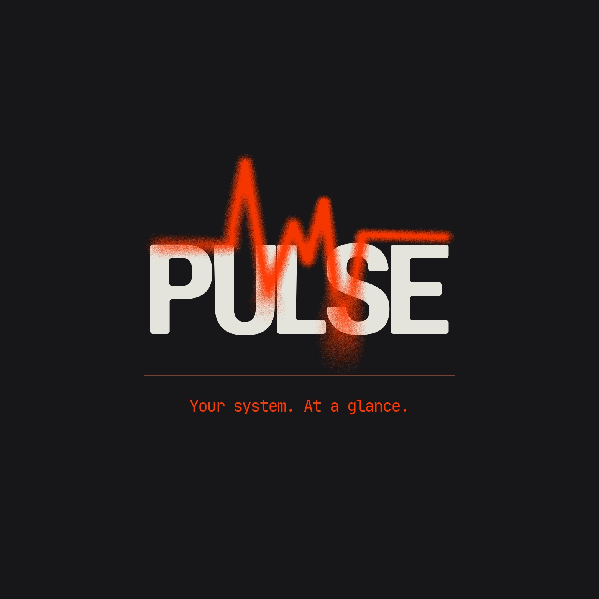
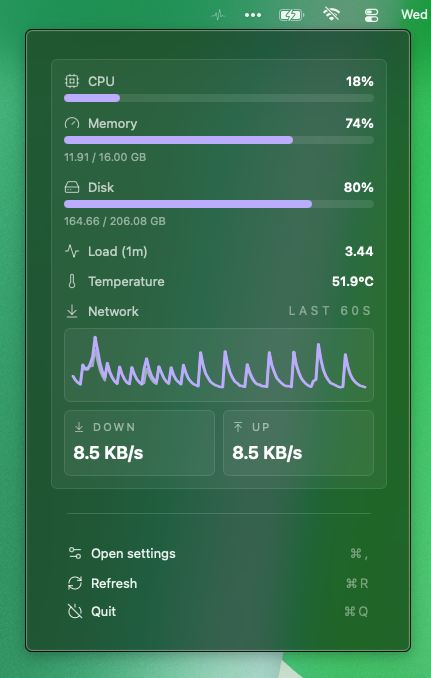

# Pulse

Pulse is a small macOS menu bar system monitor.
It shows a quick snapshot of your Mac’s system state without dashboards, charts, or noise.

<p align="center">
  
</p>
<p align="center">
  
  


---

## Features

- CPU usage
- Memory usage (used / total)
- Disk usage
- Load average
- Temperature (best-effort, may be unavailable on some systems)
- Network throughput
- Quick settings (°C / °F, accent color)
- Keyboard shortcuts

---

## Tech Stack

- Tauri (Rust)
- React + Vite
- Tailwind CSS
- sysinfo

macOS only.

---

## Running locally

### Requirements

- macOS  
- Node.js + pnpm  
- Rust toolchain  

### Development
```bash
pnpm install
pnpm tauri dev
```
### Build
```bash
pnpm tauri build
```

The `.app` bundle is generated under `src-tauri/target/release`.

---

<p align="center">
  
</p>

---

## Assets

- `src-tauri/icons/logo.jpg`: primary logo for dark surfaces  
- `src-tauri/icons/whiteBgLogo.jpg`: light-background logo variant  
- `src-tauri/icons/og-image.png`: Open Graph banner  
- `src-tauri/icons/favicon-32x32.png`: tray icon + favicon  
- `src-tauri/resources/pulse.png`: current UI screenshot  

---

## Future

- GPU metrics
- Battery health info  

No promises.

---

Open source. Do whatever you want with it.
